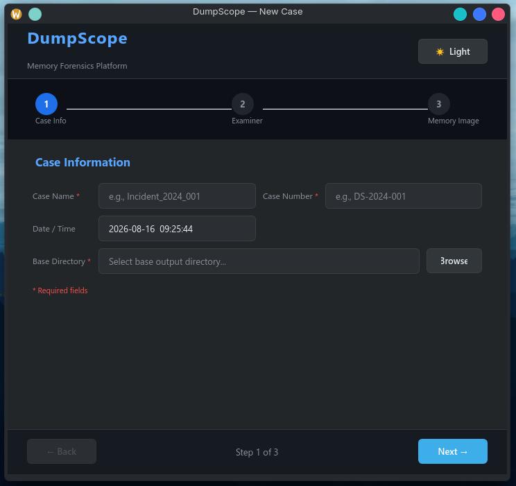
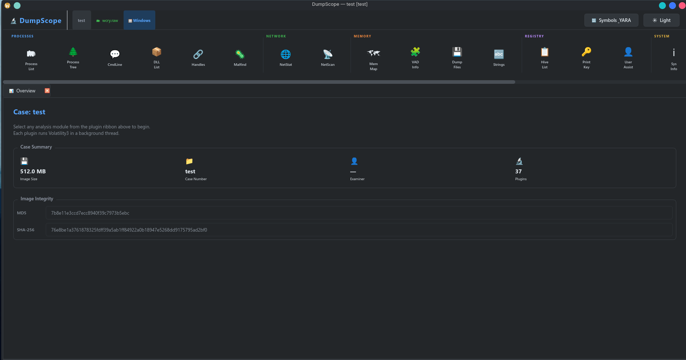

DumpScope is a memory forensics desktop application built with Python, PyQt6, and
Volatility3 — designed to streamline memory dump analysis with a wizard-driven UI
instead of raw CLI commands.

## Features

- Wizard UI walking through case setup to analysis
- Plugin ribbon for running Volatility3 plugins without memorizing syntax
- QThread-based workers keep the UI responsive during long-running analysis
- SQLite case storage — save and reopen investigations
- Automatic OS detection from the memory image
- Process dumping directly from the UI

## Screenshots

<figure>
  
  <figcaption>Case setup wizard</figcaption>
</figure>

<figure>
  
  <figcaption>Running Volatility3 plugins via the ribbon</figcaption>
</figure>

## Demo

<video controls muted playsinline preload="metadata" poster="dashboard.png" width="1904" height="1001">
  <source src="demo.mp4" type="video/mp4">
  Your browser does not support embedded video.
  <a href="demo.mp4">Download the demo (MP4)</a>.
</video>

## Architecture Notes

Threading lock serializes Volatility3 subprocess calls and handles corrupted symbol
caches. The QThread worker + signal-based communication pattern built here got reused
across later tools.
